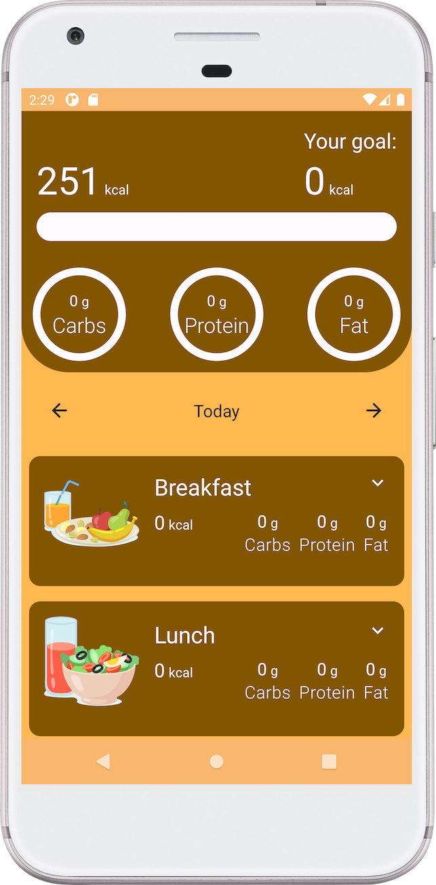
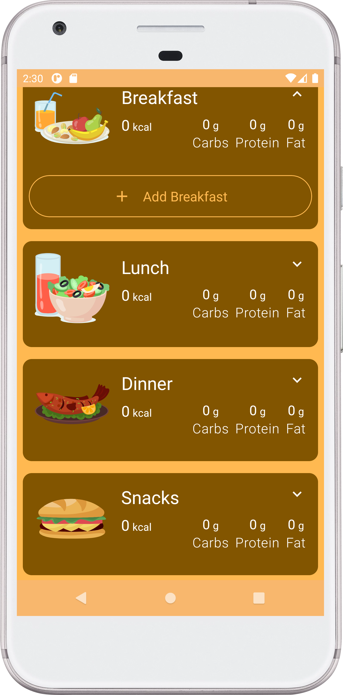
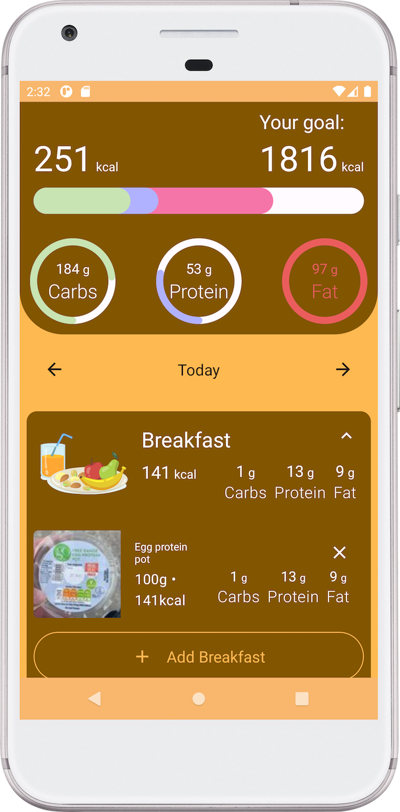

# Calorie Tracker
Multi Module Clean Architecture (MVVM/UDF) Application

## Description
A Kotlin clean multi module, MVVM - Jetpack Compose android mobile application that fetches open food api and tracks meal and shows the daily target depending on the user's input, with unit, UI and End to End tests.

### Dependencies
* Compose Dependencies
* Coroutine
* Navigation Component
* Lifecycle components
* Room
* Hilt
* Unit test dependencies
* UI test dependencies

